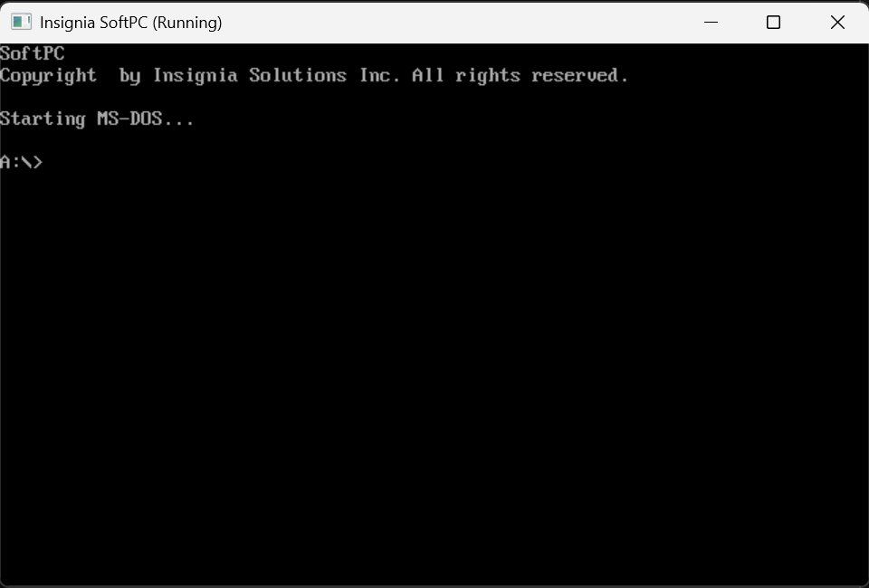
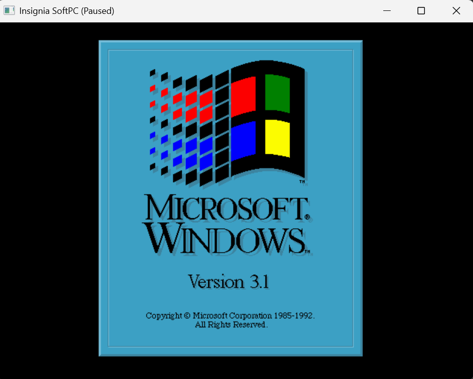
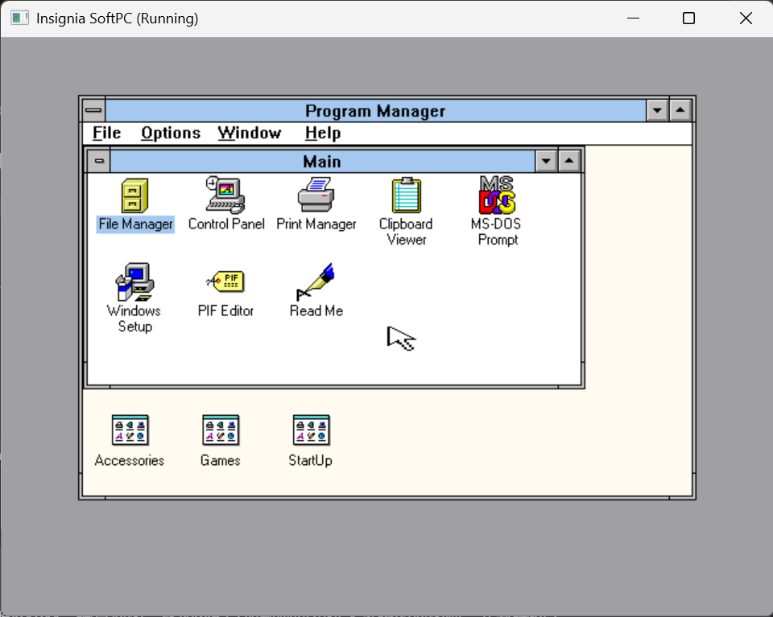

# Insignia SoftPC (revived from NTVDM)

Insignia SoftPC is a standalone PC virtual machine revived from the original
SoftPC machine source. It runs its fixed recovered machine configuration
without an NTVDM, DOS/WOW, VDD, or Windows NT host process. The machine keeps
its original ROM-level hardware behavior, including its narrow machine BOP
table, but has no NTVDM product-service dispatcher.

The machine shape is fixed: users provide boot media instead of choosing a
machine profile. Project governance, target architecture, and the ordered
recovery plan are in [docs/README.md](docs/README.md).

## In use

These are current captures of SoftPC running the bundled test media. They
show the standalone window presentation, the Windows 3.1 load screen, and a
Windows 3.1 Program Manager desktop.







## Build and run

All generated build state belongs under the repository's single `build/`
directory.  This includes CMake/Ninja metadata, generated sources, test
executables, diagnostics, and temporary test media. The user-facing package is
only `artifacts/binary/`; reusable boot media is in `artifacts/media/`. The
selected original ROMs are embedded from
`src/mvdm/softpc.new/roms/`; `artifacts/firmware/` does not exist. Do not
create sibling `build-*` directories or place generated executables at the
repository root. Build the VM, then set the fixed machine defaults in the
adjacent `artifacts/binary/softpc.ini`:

```text
cmake -S . -B build -G Ninja
cmake --build build --parallel 8
artifacts/binary/softpc64.exe
```

The CMake build supports both 32-bit and 64-bit Windows hosts.  A 32-bit
build requires a real i686 MinGW toolchain (including its Windows import and
CRT libraries), for example:

```text
cmake -S . -B build/x86 -G Ninja -DCMAKE_C_COMPILER=i686-w64-mingw32-gcc
cmake --build build/x86 --parallel 8
```

The x86 configure writes `artifacts/binary/softpc32.exe`; the native x64
configure writes `artifacts/binary/softpc64.exe`. Both use the same adjacent
`softpc.ini`.

`softpc.ini` has five `key=value` keys: `memory_mb`, `floppy`, `hard_disk`,
`display` (`console` or `window`), and `media_mode`. Both media keys may be
set together, creating fixed `A:` and `C:` slots; the machine boots `A:`
first, then `C:`. The launchers accept no command-line parameters and always
load the `softpc.ini` beside themselves; relative image paths are relative to
that file. The monitor accepts `start`, `pause`, `resume`, `stop`, `reset`,
and floppy commands; `Esc` is not a monitor hotkey.
The current
core links the detached CCPU, SAS, I/O, PIC, event, original FDC/FLA/GFI,
fixed-disk BIOS and V7 VGA packages through standalone host ports.  The
original ROM reaches only machine-resident C services through its historical
BOP instruction table; it has no NTVDM, DOS/WOW, VDD or product-service
dispatcher.  Fixed firmware, raw-media storage and console/Win32
presentation are supplied by the standalone VM, not a product host.

Set `media_mode` to choose how both configured images are attached:
`readonly` passes writes back to the original controller as write-protected,
`direct` writes the source image files directly, and `overlay` loads both
images into RAM at startup and directs all guest writes to those volatile
copies. The distributed configuration uses `overlay` for safe experimentation.

The fixed machine has 16 MiB RAM by default (configurable through
`memory_mb`), master and slave 8259 PICs, PIT channel 0, the original
keyboard/mouse controller path, original FLA/GFI/FDC floppy path, original
fixed-disk BIOS path, and original V7 VGA controller. The console presents
text memory at `B800:0000`; the Win32 window presents that text path and the
original CGA-compatible BIOS modes 04h/05h/06h, VGA mode 13h (320×200,
256-colour) planes/DAC, and the EGA/VGA 4-plane BIOS modes 0Dh through 12h
through RGB32 host surfaces. They are presentation front ends, not
replacement video controllers.
The Win32 window forwards relative pointer movement and its two buttons to
the original Microsoft Bus Mouse adapter; it does not implement a second
mouse device.

The ROM and restored controllers provide their original BIOS/interrupt and
I/O behavior.  The standalone host provides raw floppy and hard-disk image
files plus a fixed 16-head/63-sector hard-disk compatibility geometry; it
does not reinterpret partition BPBs as a second disk controller.

Serial and printer controllers are original SoftPC code connected to idle
standalone host endpoints. The original PPI and PIT channel 2 speaker path
now drives a bounded asynchronous Win32 beep sink; it is stopped with the
machine on reset or teardown. Graphical presentation remains host-front-end
work, not a reason to substitute the original VGA controller.

CTest is tiered under `test/`: `ctest -L unit` uses only source and test
fixtures, while `ctest -L integration` launches the packaged no-argument
launcher and validates its adjacent configuration and declared media roots.

## Source layout

- `assets/readme/` — owner-provided current product screenshots used by this
  README; they are documentation assets, not guest media or runtime inputs.
- `src/mvdm/softpc.new/roms/` — byte-identical selected original ROM inputs.
- `src/core/softpc/` — transitional recovered SoftPC CPU baseline, to be
  migrated by M8 under the source-mirror plan.
- `src/core/` — transitional standalone lifecycle, physical-memory ownership,
  CPU/device composition and host-port contracts around that source tree.
- `src/vm/` — transitional executable entry point, console, Win32
  presentation and media attachment. It never owns CPU, guest RAM or device
  state.
- `test/unit/`, `test/integration/`, `test/support/` — self-contained unit,
  fixed-package integration, and shared/diagnostic test support respectively.

The standalone core never accepts a product-shell callback or selector
service. Hardware and firmware behavior is machine-owned state and typed
mechanical outcomes.
