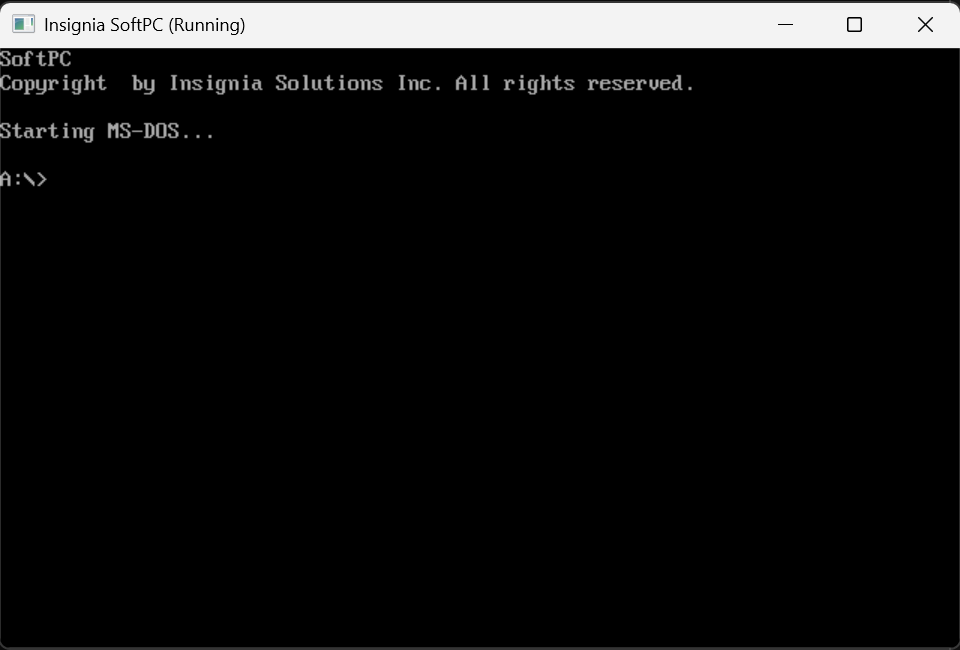
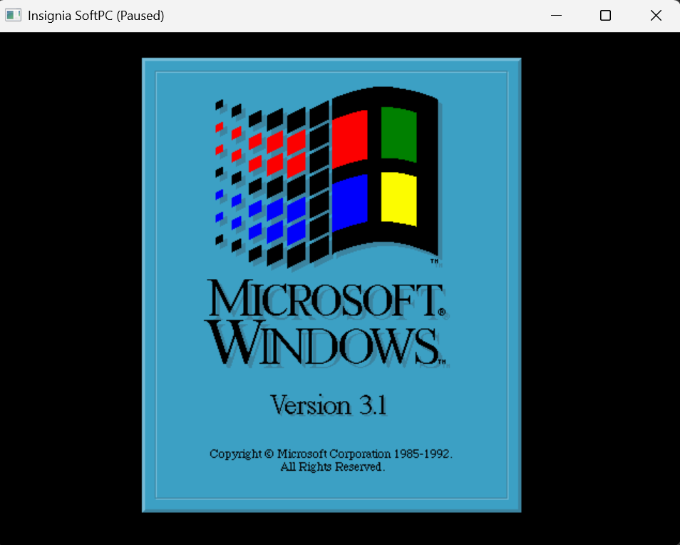
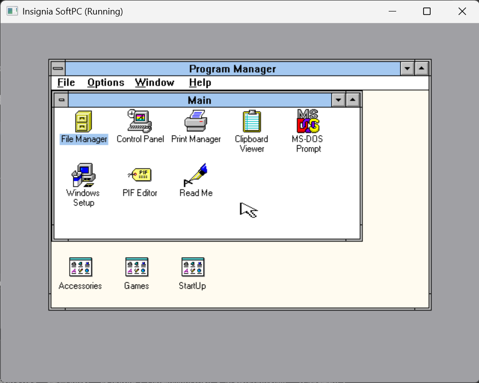

# Insignia SoftPC (revived from NTVDM)

Insignia SoftPC is a standalone PC virtual machine revived from the original
SoftPC machine source. It runs its fixed recovered machine configuration
without an NTVDM, DOS/WOW, VDD, or Windows NT host process. The machine keeps
its original ROM-level hardware behavior, including its narrow machine BOP
table, but has no NTVDM product-service dispatcher.

The machine shape is fixed: users provide boot media instead of choosing a
machine profile. Project governance, target architecture, and the ordered
recovery plan are in [docs/README.md](docs/README.md).

## In use

These are current captures of SoftPC running the bundled test media. They
show the standalone window presentation, the Windows 3.1 load screen, and a
Windows 3.1 Program Manager desktop.







## Quick start

### Run the bundled package

On 64-bit Windows, clone the repository and run the checked-in package; no
compiler or extra download is required for this route:

```powershell
git clone https://github.com/cshaxu/softpc.git
Set-Location softpc
.\assets\binary\softpc64.exe
```

The default adjacent `softpc.ini` safely attaches the bundled Windows 3.1
image through an in-memory overlay. At the monitor prompt, enter `start` to
boot it. Do not move the executable away from its adjacent INI, or alter the
INI merely to try the bundled machine.

### Build from source

The supported source-build environment is the [MSYS2 UCRT64
shell](https://www.msys2.org/). Install MSYS2, open **MSYS2 UCRT64**, and run:

```sh
pacman -Syu
# Restart the UCRT64 shell if MSYS2 asks you to do so, then run:
pacman -S --needed git mingw-w64-ucrt-x86_64-toolchain mingw-w64-ucrt-x86_64-cmake
git clone https://github.com/cshaxu/softpc.git
cd softpc
cmake --preset mingw-gcc-x64-release
cmake --build --preset package-x64
./assets/binary/softpc64.exe
```

The first command may request that MSYS2 itself be updated and the shell
restarted before package installation continues. The resulting package is
still `assets/binary/softpc64.exe`, beside the user-owned `softpc.ini`.

To run the background regression suite instead of launching the VM:

```sh
cmake --build --preset tests-x64
ctest --preset test-x64
```

### Optional 32-bit package

Open **MSYS2 MINGW32** rather than UCRT64, install its toolchain and CMake,
then use the existing x86 presets:

```sh
pacman -S --needed git mingw-w64-i686-toolchain mingw-w64-i686-cmake
git clone https://github.com/cshaxu/softpc.git
cd softpc
cmake --preset mingw-gcc-x86-release
cmake --build --preset package-x86
./assets/binary/softpc32.exe
```

The shell selects the matching GCC through `PATH`; no personal drive path or
repository-specific toolchain variable is required.

### Faster local Ninja route

The default Makefiles presets remain the conservative package route.  For
faster local incremental builds, Ninja uses a separate build directory and the
same compiler and Release flags:

```sh
cmake --preset ninja-gcc-x64-release
cmake --build --preset ninja-tests-x64
ctest --preset ninja-test-x64
```

Use `ninja-gcc-x86-release`, `ninja-package-x86`, `ninja-tests-x86` and
`ninja-test-x86` from an MSYS2 MINGW32 shell for the 32-bit route.  All checked
in build and background-test presets use a bounded eight jobs; desktop tests
remain serial and explicit.

### Optional compiler cache

When `ccache` is already available on `PATH`, the opt-in
`ninja-ccache-gcc-x64-release` and `ninja-ccache-gcc-x86-release` configure
presets use it as the C compiler launcher. Their matching build and test
presets start with `ninja-ccache-`. The cache is developer-local rather than a
repository artifact; its Windows default is `%LOCALAPPDATA%\\ccache`, or set
`CCACHE_DIR` to choose another local directory. The regular Ninja and
Makefiles routes do not require or use ccache.

## Build and package details

All generated build state belongs under the repository's single `build/`
directory.  This includes CMake/Ninja metadata, generated sources, test
executables, diagnostics, and temporary test media. The user-facing package is
only `assets/binary/`; reusable boot media is in `assets/media/`. The
selected original ROMs are embedded from
`src/app-softpc/softpc.new/roms/`; `assets/roms/` does not exist. Do not
create sibling `build-*` directories or place generated executables at the
repository root. The fixed machine defaults are in the adjacent
`assets/binary/softpc.ini`:

```text
cmake --preset mingw-gcc-x64-release
cmake --build --preset package-x64 --parallel
assets/binary/softpc64.exe
```

The x86 configure writes `assets/binary/softpc32.exe`; the native x64
configure writes `assets/binary/softpc64.exe`. Both use the same adjacent
`softpc.ini`.

Run a width's complete regression with `cmake --build --preset tests-x64` then
`ctest --preset test-x64`, or the corresponding `x86` presets from the
matching MSYS2 MINGW32 shell. The presets validate that the selected compiler
pointer width and package architecture agree.

`softpc.ini` configures memory, optional floppy/hard-disk media and attachment
modes, display, Console control, and optional serial/printer endpoints.
`display` is `console` or `window`. Both media keys may be
set together, creating fixed `A:` and `C:` slots; the machine boots `A:`
first, then `C:`. The launchers accept no command-line parameters and always
load the `softpc.ini` beside themselves; relative image paths are relative to
that file. The monitor accepts `start`, `pause`, `resume`, `stop`, `reset`,
and floppy commands; `Esc` is not a monitor hotkey.
The current
core links the detached CCPU, SAS, I/O, PIC, event, original FDC/FLA/GFI,
fixed-disk BIOS and V7 VGA packages through standalone host ports.  The
original ROM reaches only machine-resident C services through its historical
BOP instruction table; it has no NTVDM, DOS/WOW, VDD or product-service
dispatcher.  Fixed firmware, raw-media storage and console/Win32
presentation are supplied by the standalone VM, not a product host.

Set `floppy_mode` and `hard_disk_mode` independently to choose how each configured image is attached:
`readonly` passes writes back to the original controller as write-protected,
`direct` writes the source image files directly, and `overlay` loads both
images into RAM at startup and directs all guest writes to those volatile
copies. The distributed configuration uses `overlay` for safe experimentation.
While stopped or paused, `floppy insert <readonly|direct|overlay> <image>`
replaces drive A using the chosen policy; `floppy eject` removes it.

The fixed machine has 16 MiB RAM by default (configurable through
`memory_mb`), master and slave 8259 PICs, PIT channel 0, the original
keyboard/mouse controller path, original FLA/GFI/FDC floppy path, original
fixed-disk BIOS path, and original V7 VGA controller. The console presents
text memory at `B800:0000`; the Win32 window presents that text path and the
original CGA-compatible BIOS modes 04h/05h/06h, VGA mode 13h (320×200,
256-colour) planes/DAC, and the EGA/VGA 4-plane BIOS modes 0Dh through 12h
through RGB32 host surfaces. They are presentation front ends, not
replacement video controllers.
The Win32 window forwards relative pointer movement and its two buttons to
the original Microsoft Bus Mouse adapter; it does not implement a second
mouse device.

The ROM and restored controllers provide their original BIOS/interrupt and
I/O behavior.  The standalone host provides raw floppy and hard-disk image
files plus a fixed 16-head/63-sector hard-disk compatibility geometry; it
does not reinterpret partition BPBs as a second disk controller.

Serial and printer controllers are original SoftPC code connected to idle
standalone host endpoints. The original PPI and PIT channel 2 speaker path
now drives a bounded asynchronous Win32 beep sink; it is stopped with the
machine on reset or teardown. Graphical presentation remains host-front-end
work, not a reason to substitute the original VGA controller.

CTest's default `test-x64`/`test-x86` presets run background tests. Real native
Window/Console and package tests have separate `test-desktop-x64`/`test-desktop-x86`
presets; see [test execution](docs/design/CODING.md#build-output-layout).

## Source layout

- `assets/readme/` — owner-provided current product screenshots used by this
  README; they are documentation assets, not guest media or runtime inputs.
- `src/app-softpc/softpc.new/` — recovered original SoftPC machine, including the
  embedded selected BIOS/VGA/CMOS ROM inputs, retained in its historical tree.
- `src/app-softpc/softpc.new/` may contain narrow, reviewable compiler/host-ABI
  source diffs at the affected point; it contains no new machine policy.
- `src/app-softpc/compat/` — original SoftPC host callbacks, media/video surfaces and ABI support.
- `src/app-softpc/machine/` — SoftPC backend adaptation to the existing Emulator machine contract.
- `src/app-softpc/product/` — configuration, product CLI/hotkey policy and entity assembly;
  only main consumes the VM public interface.
- `src/emulator/` — shared machine executor, session control and UI composition.
- `src/x86/` — optional shared x86 debugger and assembly/disassembly components.
- `src/lib/` — shared platform mechanics; unchanged by the app/VM/Compat refactor.
- `test/unit/`, `test/app-softpc/integration/`, `test/support/` — self-contained unit,
  fixed-package integration, and shared/diagnostic test support respectively.

The standalone core never accepts a product-shell callback or selector
service. Hardware and firmware behavior is machine-owned state and typed
mechanical outcomes.
